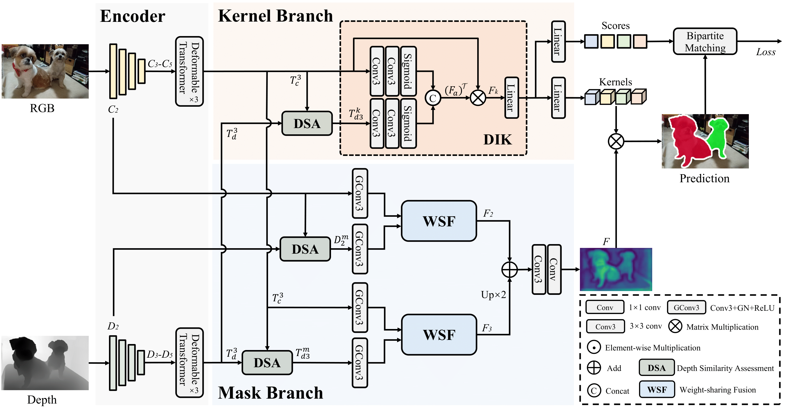

# CalibNet (TIP 2024)


Official Implementation of "[CalibNet: Dual-branch Cross-modal Calibration for RGB-D Salient Instance Segmentation](https://arxiv.org/pdf/2307.08098)"

[Jialun Pei](https://scholar.google.com/citations?user=1lPivLsAAAAJ&hl=en), [Tao Jiang](https://github.com/Jtao0818), [He Tang](https://scholar.google.com/citations?hl=en&user=70XLFUsAAAAJ), [Nian Liu](https://scholar.google.com/citations?user=ZSilWs4AAAAJ&hl=zh-CN), [Yueming Jin](https://yuemingjin.github.io/), [Deng-Ping Fan](https://dengpingfan.github.io/), and [Pheng-Ann Heng](https://scholar.google.com/citations?user=OFdytjoAAAAJ&hl=zh-CN)

[[Paper]](https://arxiv.org/abs/2207.02255); [[Chinese Version]](); [Official Version]

**Contact:** dengpfan@gmail.com, peijialun@gmail.com

## Environment preparation

### Requirements
- Linux with python ≥ 3.8
- Pytorch ≥ 1.9 and torchvison that matches the Pytorch installation.
- Detectron2: follow [Detectron2 installation instructions](https://detectron2.readthedocs.io/tutorials/install.html).
- OpenCV is optional but needed by demo and visualization.
- `pip install -r requirements.txt`

### CUDA kernel for MSDeformAttn
After preparing the required environment, run the following command to compile CUDA kernel for MSDeformAttn:
`CUDA_HOME` must be defined and points to the directory of the installed CUDA toolkit.
```bash
cd calibnet/trans_encoder/ops
sh make.sh
```

### Example conda environment setup
Our project is built upon the [detectron2](https://github.com/facebookresearch/detectron2) framework. In order to accommodate the RGB-D SIS task, we have made some modifacations to the framework to handle its dual modality inputs. You could replace the `c2_model_loading.py` in the framework with the one we provide `calibnet/c2_model_loading.py`.

We give an example to setup the environment. The commands are verified on CUDA 11.1, pytorch 1.9.1 and detectron2 0.6.0.
```shell
# an example
# create virtual environment
conda create -n calibnet python=3.8 -y
conda activate calibnet
# install pytorch
pip install torch==1.9.1+cu111 torchvision==0.10.1+cu111 torchaudio==0.9.1 -f https://download.pytorch.org/whl/torch_stable.html
# install detectron2, use the pre-built detectron2
python -m pip install detectron2 -f \
  https://dl.fbaipublicfiles.com/detectron2/wheels/cu111/torch1.9/index.html
# install requierement packages
pip install -r requirements.txt
# build CUDA kernel for MSDeformAttn
cd calibnet/trans_encoder/ops
sh make.sh
# replace the model loading code in detectron2. You should specify your own detectron2 path.
cp -i calibnet/c2_model_loading.py detectron2/checkpoint/c2_model_loading.py

```                                      

## Dataset preparation

### Download the datasets and annotation files

- **COME15K**: [Google Drive](https://drive.google.com/drive/folders/1YLgP3mQIEp0MB8rk4YYUDpISkDgnMIaM?usp=drive_link)
- **DSIS**: [Google Drive](https://drive.google.com/drive/folders/1GRkoSaF40WAFxM8dEE1zlVGgK7E9e7Kg?usp=drive_link)
- **SIP**: [Google Drive](https://drive.google.com/drive/folders/1-0gRLkBp_8bim5KrtZ86q1QNGmZCCxYw?usp=drive_link)

### Register datasets

1. Download the datasets and put them in the same folder. To match the folder name in the dataset mappers, you'd better not change the folder names, its structure may be:

```
    DATASET_ROOT/
    ├── COME15K
       ├── train
          ├── imgs_right
          ├── depths
          ├── ...
       ├── COME-E
          ├── RGB
          ├── depth
          ├── ...
       ├── COME-H
          ├── RGB
          ├── depth
          ├── ...
       ├── annotations
       ├── ...
    ├── DSIS
       ├── RGB
       ├── depth
       ├── dsis.json
       ├── ...
    ├── SIP
       ├── RGB
       ├── depth
       ├── sip.json
       ├── ...
```

2. Change the dataset root in `calibnet/register_rgbdsis_datasets.py`

```python
# calibnet/register_rgbdsis_datasets.py   line 28
_root = os.getenv("DETECTRON2_DATASETS", "path/to/dataset/root")
```

## Pre-trained models
Model weights: [Google Drive](https://drive.google.com/drive/folders/19n_Sb6Y4C9uzsqyX6OhkzN6XAjI1iOLI?usp=drive_link)

| Model     | Config                                                    | COME15K-E-test AP  | COME15K-H-test AP  | 
| :-------- | :---------------------------------------------------------| :----------------- | :----------------- | 
| R50       | [config](configs/CalibNet_R50_50e_50q_320size.yaml)       | 58.0               | 50.7               | 
| R101      | [config](configs/CalibNet_R101_50e_50q_320size.yaml)      | 58.5               | 51.5               | 
| Swin-T    | [config](configs/CalibNet_SwinT_50e_50q_320size.yaml)     | 60.0               | 52.6               | 
| PVT-v2    | [config](configs/CalibNet_PVT_50e_50q_320size.yaml)       | 60.7               | 53.7               | 
| P2T-Large | [config](configs/CalibNet_P2T_large_50e_50q_320size.yaml) | 61.8               | 54.4               |

## Usage

### Train
To train our CalibNet on single GPU, you should specify the config file `<CONFIG>`.
```shell
python tools/train_net.py --config-file <CONFIG> --num-gpus 1
# example:
python tools/train_net.py --config-file configs/CalibNet_R50_50e_50q_320size.yaml --num-gpus 1 OUTPUT_DIR output/train
```

### Eval

Before evaluating, you should specify the config file `<CONFIG>` and the model weights `<WEIGHT_PATH>`. In addition, the input size is set to 320 by default.

```shell
python tools/train_net.py --config-file <CONFIG> --num-gpus 1 --eval-only MODEL.WEIGHTS <WEIGHT_PATH>
# example:
python tools/train_net.py --config-file configs/CalibNet_R50_50e_50q_320size.yaml --num-gpus 1 --eval-only MODEL.WEIGHTS weights/calibnet_r50_50e.pth OUTPUT_DIR output/eval
```

### Get model statistics

We provide some tools to obtain model statistics such as Parameters, GFLOPS and inference fps. The usages are as follow.


```shell
# fps
python tools/count_fps.py --config-file <CONFIG> INPUT.MIN_SIZE_TEST 320 MODEL.WEIGHTS <WEIGHT_PATH>
# Parameters
python tools/get_flops.py --tasks parameter --config-file <CONFIG> MODEL.WEIGHTS <WEIGHTS_PATH>
# GFLOPS
python tools/get_flops.py --tasks flop --config-file <CONFIG> MODEL.WEIGHTS <WEIGHT_PATH>
```

## Acknowledgement

This work is based on [detectron2](https://github.com/facebookresearch/detectron2). We sincerely thanks for their great work and contributions to the community!

## Citation

If this helps you, please cite this work:

```
@article{pei2024calibnet,
  title={CalibNet: Dual-branch Cross-modal Calibration for RGB-D Salient Instance Segmentation},
  author={Pei, Jialun and Jiang, Tao and Tang, He and Liu, Nian and Jin, Yueming and Fan, Deng-Ping and Heng, Pheng-Ann},
  booktitle={IEEE Transactions on Image Processing},
  year={2024},
  organization={IEEE}
}
```